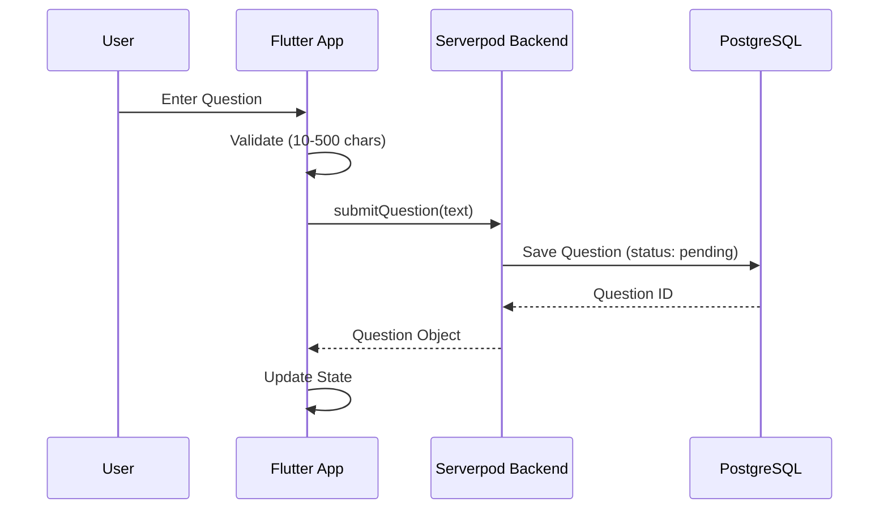
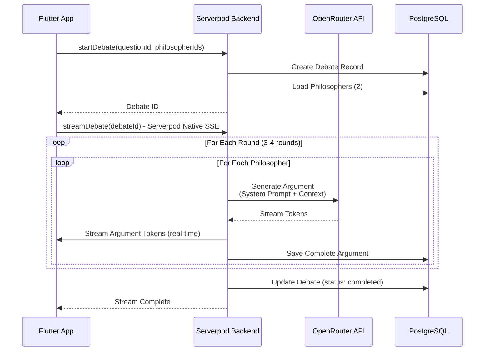
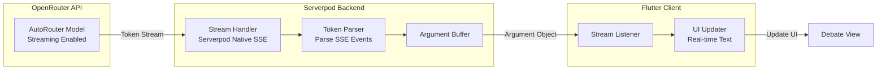

# Agora - Technical Architecture Diagram

## System Architecture Overview

This diagram illustrates how the Flutter frontend interacts with the Serverpod backend and AI services.

```mermaid
graph TB
    subgraph "Client Layer"
        Flutter[Flutter App<br/>Web/iOS/Android/Desktop]
        UI_Question[Question Input Screen]
        UI_Debate[Debate View Screen]
        StateMgmt[State Management<br/>Provider/Riverpod/Bloc]
        ServerpodClient[Serverpod Client]
    end

    subgraph "Backend Layer - Serverpod"
        ServerpodBackend[Serverpod Backend<br/>Dart Framework]
        
        subgraph "API Endpoints"
            EP_Question[submitQuestion()<br/>getQuestion()]
            EP_Debate[startDebate()<br/>getDebate()<br/>streamDebate()]
            EP_Philosopher[listPhilosophers()<br/>getPhilosopher()]
        end
        
        subgraph "Business Logic"
            DebateGen[Debate Generation Logic<br/>Sequential Turn-based]
            StreamingService[Streaming Service<br/>Serverpod Native SSE]
        end
        
        subgraph "Data Models"
            Model_Question[Question Model]
            Model_Debate[Debate Model]
            Model_Argument[Argument Model]
            Model_Philosopher[Philosopher Model]
        end
    end

    subgraph "AI Services"
        OpenRouter[OpenRouter API<br/>AutoRouter Model]
        AI_Streaming[AI Streaming<br/>Token Generation]
    end

    subgraph "Data Layer"
        PostgreSQL[(PostgreSQL Database<br/>Digital Ocean)]
        Tables[Tables:<br/>Questions<br/>Debates<br/>Arguments<br/>Philosophers]
    end

    %% Flutter Internal Connections
    Flutter --> UI_Question
    Flutter --> UI_Debate
    UI_Question --> StateMgmt
    UI_Debate --> StateMgmt
    StateMgmt --> ServerpodClient

    %% Client to Backend - REST API Calls
    ServerpodClient -->|1. Submit Question| EP_Question
    ServerpodClient -->|2. Get Question| EP_Question
    ServerpodClient -->|3. Start Debate| EP_Debate
    ServerpodClient -->|4. Get Debate| EP_Debate
    ServerpodClient -->|5. Get Philosophers| EP_Philosopher

    %% Client to Backend - Real-time Streaming
    ServerpodClient -->|6. Stream Arguments<br/>Serverpod Native SSE| StreamingService
    StreamingService --> EP_Debate

    %% Backend Internal Flow
    EP_Question --> Model_Question
    EP_Debate --> Model_Debate
    EP_Debate --> DebateGen
    EP_Philosopher --> Model_Philosopher
    DebateGen --> Model_Philosopher
    DebateGen --> Model_Argument
    DebateGen --> StreamingService
    StreamingService --> Model_Argument

    %% Backend to AI Services
    DebateGen -->|7. Generate Argument<br/>with System Prompt| OpenRouter
    OpenRouter -->|8. Stream Tokens| AI_Streaming
    AI_Streaming -->|9. Return Tokens| DebateGen

    %% Backend to Database
    Model_Question -->|10. Save/Read| PostgreSQL
    Model_Debate -->|11. Save/Read| PostgreSQL
    Model_Argument -->|12. Save/Read| PostgreSQL
    Model_Philosopher -->|13. Save/Read| PostgreSQL
    PostgreSQL --> Tables

    %% Styling
    classDef flutter fill:#42A5F5,stroke:#1976D2,stroke-width:2px,color:#fff
    classDef serverpod fill:#00D4AA,stroke:#00A67E,stroke-width:2px,color:#fff
    classDef ai fill:#FF6B6B,stroke:#C92A2A,stroke-width:2px,color:#fff
    classDef database fill:#4ECDC4,stroke:#2E8B87,stroke-width:2px,color:#fff

    class Flutter,UI_Question,UI_Debate,StateMgmt,ServerpodClient flutter
    class ServerpodBackend,EP_Question,EP_Debate,EP_Philosopher,DebateGen,StreamingService,Model_Question,Model_Debate,Model_Argument,Model_Philosopher serverpod
    class OpenRouter,AI_Streaming ai
    class PostgreSQL,Tables database
```

## Data Flow Sequence

### 1. Question Submission Flow



### 2. Debate Generation & Streaming Flow



### 3. Real-time Streaming Architecture



## Component Details

### Flutter Frontend Components

- **Question Input Screen**: Text input with validation, submit button
- **Debate View Screen**: Real-time streaming display, philosopher cards, argument timeline
- **State Management**: Manages question state, debate state, streaming state
- **Serverpod Client**: Type-safe API client, handles REST and streaming connections

### Serverpod Backend Components

- **API Endpoints**: Type-safe method-based endpoints for questions, debates, philosophers
- **Debate Generation Logic**: Sequential turn-based generation, maintains conversation context
- **Streaming Service**: Serverpod native streaming (SSE) for real-time updates
- **Data Models**: Type-safe models with Serverpod ORM

### AI Services

- **OpenRouter API**: AutoRouter model automatically selects best available model
- **Streaming**: Token-by-token generation for real-time display
- **System Prompts**: Each philosopher has unique system prompt defining their style

### Database Layer

- **PostgreSQL**: Hosted on Digital Ocean
- **Tables**: Questions, Debates, Arguments, Philosophers
- **ORM**: Serverpod handles migrations and database operations

## Key Interactions

1. **Question Submission**: Flutter → Serverpod → PostgreSQL
2. **Debate Initiation**: Flutter → Serverpod → PostgreSQL (create debate)
3. **Real-time Streaming**: OpenRouter → Serverpod → Flutter (Serverpod Native SSE)
4. **Data Persistence**: Serverpod → PostgreSQL (save arguments as they complete)
5. **Philosopher Management**: Flutter → Serverpod → PostgreSQL (load philosopher data)

## Technology Stack

- **Frontend**: Flutter (Dart) - Cross-platform
- **Backend**: Serverpod (Dart) - Type-safe backend framework
- **AI**: OpenRouter API - AutoRouter model with streaming
- **Database**: PostgreSQL on Digital Ocean
- **Streaming**: Serverpod native streaming (SSE)
- **State Management**: Provider, Riverpod, or Bloc
